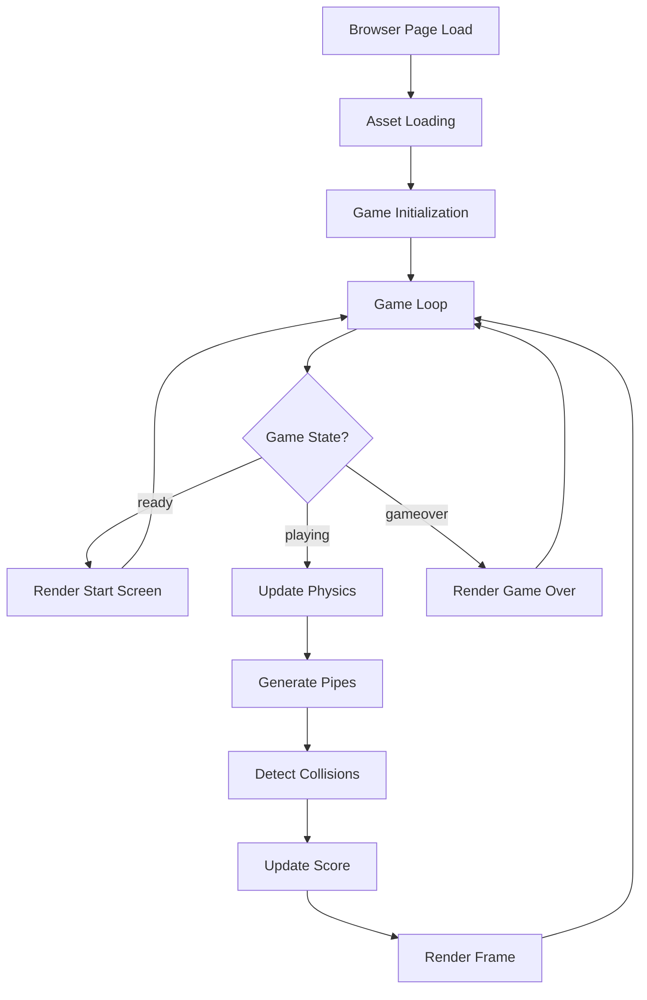
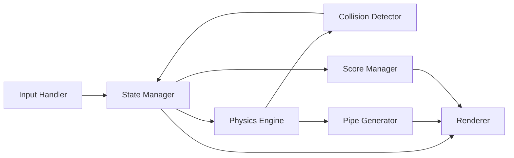

# Design Document: Flappy Bird Game

## Overview

This design describes a browser-based Flappy Bird clone built with HTML5 Canvas and vanilla JavaScript. The player controls a rabbit character (loaded from `usagi.webp`) that must navigate through gaps between vertically-paired pipes. The game runs entirely client-side with no server dependencies.

The architecture follows a game loop pattern with clear separation between state management, physics simulation, rendering, and input handling. Delta-time physics ensure consistent behavior across varying frame rates.

## Architecture

The game uses a single-page architecture with one HTML file, one JavaScript module, and the sprite asset. The core pattern is a fixed-timestep game loop driven by `requestAnimationFrame`.



### High-Level Component Interaction



## Components and Interfaces

### 1. GameEngine (Main Controller)

Orchestrates the game loop and coordinates all subsystems.

```javascript
class GameEngine {
  constructor(canvas)
  init()                    // Load assets, set up event listeners
  start()                   // Begin the game loop
  update(deltaTime)         // Update game state per frame
  render()                  // Draw current frame
  reset()                   // Reset game to ready state
}
```

### 2. Player

Manages the rabbit character's state and physics.

```javascript
class Player {
  constructor(sprite, x, y)
  flap()                    // Apply upward velocity impulse
  update(deltaTime)         // Apply gravity, update position and rotation
  getHitbox()               // Return bounding rectangle for collision
  render(ctx)               // Draw sprite with rotation
}
```

### 3. PipeManager

Handles pipe generation, movement, and cleanup.

```javascript
class PipeManager {
  constructor(canvasWidth, canvasHeight, gapSize)
  update(deltaTime)         // Move pipes, generate new ones, remove off-screen
  getPipes()                // Return array of active pipe pairs
  reset()                   // Clear all pipes
  render(ctx)               // Draw all pipes
}
```

### 4. CollisionDetector

Pure function module for detecting overlaps.

```javascript
const CollisionDetector = {
  checkPipeCollision(playerHitbox, pipes)   // Returns boolean
  checkBoundaryCollision(playerHitbox, canvasHeight) // Returns boolean
}
```

### 5. ScoreManager

Tracks current score and session high score.

```javascript
class ScoreManager {
  constructor()
  checkScore(playerX, pipes)  // Increment if player passed a pipe midpoint
  getScore()                  // Return current score
  getHighScore()              // Return session high score
  reset()                     // Reset current score, preserve high score
  render(ctx, canvasWidth)    // Draw score on canvas
}
```

### 6. InputHandler

Normalizes input from keyboard, mouse, and touch.

```javascript
class InputHandler {
  constructor(canvas)
  onAction(callback)        // Register a callback for flap/start/restart
  destroy()                 // Remove event listeners
}
```

### 7. Background

Renders a scrolling background for visual motion.

```javascript
class Background {
  constructor(canvasWidth, canvasHeight)
  update(deltaTime)         // Scroll background
  render(ctx)               // Draw background layers
}
```

## Data Models

### GameState Enum

```javascript
const GameState = {
  READY: 'ready',
  PLAYING: 'playing',
  GAME_OVER: 'gameover'
}
```

### Player State

```javascript
{
  x: number,           // Horizontal position (fixed during gameplay)
  y: number,           // Vertical position
  velocity: number,    // Current vertical velocity (positive = downward)
  rotation: number,    // Sprite rotation in radians
  width: number,       // Hitbox width (derived from sprite)
  height: number       // Hitbox height (derived from sprite)
}
```

### Pipe Pair

```javascript
{
  x: number,           // Horizontal position of the pipe pair
  gapY: number,        // Vertical center of the gap
  gapSize: number,     // Height of the gap opening
  width: number,       // Pipe width
  scored: boolean      // Whether this pipe has been scored
}
```

### Game Constants

```javascript
const CONFIG = {
  CANVAS_WIDTH: 400,
  CANVAS_HEIGHT: 600,
  GRAVITY: 980,              // pixels/sec^2
  FLAP_VELOCITY: -300,       // pixels/sec (negative = upward)
  PIPE_SPEED: 150,           // pixels/sec
  PIPE_SPAWN_INTERVAL: 1.8,  // seconds
  PIPE_WIDTH: 52,
  GAP_SIZE: 140,             // pixels between top and bottom pipe
  GAP_MIN_Y: 100,            // minimum gap center from top
  GAP_MAX_Y_OFFSET: 100,    // minimum gap center from bottom
  PLAYER_X: 80,             // fixed horizontal position
  MAX_ROTATION: Math.PI / 4, // max downward tilt
  MIN_ROTATION: -Math.PI / 6 // max upward tilt
}
```

### Hitbox Rectangle

```javascript
{
  x: number,      // Top-left x
  y: number,      // Top-left y
  width: number,
  height: number
}
```

## Correctness Properties

*A property is a characteristic or behavior that should hold true across all valid executions of a system — essentially, a formal statement about what the system should do. Properties serve as the bridge between human-readable specifications and machine-verifiable correctness guarantees.*

### Property 1: Gravity applies constant acceleration

*For any* positive deltaTime and any player state, after a physics update (without flap), the player's velocity should increase by exactly `GRAVITY * deltaTime`.

**Validates: Requirements 2.2**

### Property 2: Flap resets velocity regardless of state

*For any* player state (any current velocity and position), calling flap() should set the player's velocity to exactly `FLAP_VELOCITY`, regardless of the previous velocity.

**Validates: Requirements 2.3**

### Property 3: Rotation reflects movement direction

*For any* player velocity value, the player's rotation should be negative (tilted upward) when velocity is negative, positive (tilted downward) when velocity is positive, and clamped within `[MIN_ROTATION, MAX_ROTATION]`.

**Validates: Requirements 2.4**

### Property 4: Pipe generation respects spawn interval

*For any* elapsed time since last pipe spawn, a new pipe should be generated if and only if the elapsed time is greater than or equal to `PIPE_SPAWN_INTERVAL`.

**Validates: Requirements 3.1**

### Property 5: Gap position is always within playable bounds

*For any* generated pipe pair, the gap center Y coordinate should be within the range `[GAP_MIN_Y, canvasHeight - GAP_MAX_Y_OFFSET]`.

**Validates: Requirements 3.2**

### Property 6: Pipes move at constant speed

*For any* set of active pipes and any positive deltaTime, after an update each pipe's x position should decrease by exactly `PIPE_SPEED * deltaTime`.

**Validates: Requirements 3.3**

### Property 7: Off-screen pipes are removed

*For any* game state after an update, no pipe in the active pipes array should have `x + width < 0`.

**Validates: Requirements 3.4**

### Property 8: Gap size is invariant

*For any* pipe pair, the vertical distance between the top pipe's bottom edge and the bottom pipe's top edge should always equal `GAP_SIZE`.

**Validates: Requirements 3.5**

### Property 9: Rectangle overlap detection is correct

*For any* two rectangles (player hitbox and pipe hitbox), `checkPipeCollision` should return true if and only if the rectangles share a non-zero area (standard AABB overlap test).

**Validates: Requirements 4.2**

### Property 10: Boundary collision detection

*For any* player hitbox, `checkBoundaryCollision` should return true if and only if the player's y coordinate is less than 0 or the player's y + height exceeds `canvasHeight`.

**Validates: Requirements 4.3, 4.4**

### Property 11: Score increments exactly once per pipe

*For any* pipe pair where the player's x position crosses the pipe's horizontal midpoint (`pipe.x + pipe.width / 2`), the score should increment by exactly 1, and subsequent frames should not increment again for the same pipe.

**Validates: Requirements 5.1**

### Property 12: High score is the maximum of all game scores

*For any* sequence of completed games with scores, the high score should always equal the maximum value in that sequence.

**Validates: Requirements 6.3**

### Property 13: Frame-rate-independent physics

*For any* total elapsed time T, simulating player physics with N small equal deltaTime steps should produce approximately the same final position (within a small epsilon) as simulating with M larger equal deltaTime steps, where N * dt_small = M * dt_large = T.

**Validates: Requirements 7.2**

## Error Handling

### Asset Loading Failure

- If `usagi.webp` fails to load, display an error message on the canvas and prevent game start.
- Use the `Image.onerror` callback to detect load failures.

### Browser Compatibility

- If `requestAnimationFrame` is unavailable (very old browsers), fall back to `setTimeout` with a 16ms interval.
- If Canvas 2D context is unavailable, display a "browser not supported" message.

### Input Edge Cases

- Ignore rapid repeated inputs (debounce flap to prevent physics exploits) — optional, depends on desired difficulty.
- Prevent default behavior on spacebar to avoid page scrolling.

### Frame Timing

- Cap deltaTime to a maximum value (e.g., 100ms) to prevent physics explosions when the tab is backgrounded and resumed.
- If deltaTime is 0 or negative (clock anomaly), skip the frame update.

### Canvas Resize

- Listen for `resize` events and recalculate canvas scaling.
- Maintain game logic at fixed resolution; only CSS scaling changes.

## Testing Strategy

### Unit Tests (Example-Based)

Unit tests cover specific scenarios, initialization, state transitions, and rendering verification:

- **Game Initialization**: Canvas created at correct dimensions, sprite loaded successfully
- **State Transitions**: ready → playing on input, playing → gameover on collision, gameover → ready on input
- **Input Handling**: Spacebar, click, and tap all trigger flap callback
- **Rendering**: Score displayed during play, final/high score displayed on game over
- **Pipe Cleanup**: Verify pipes are removed when off-screen (concrete example)
- **Game Over Stops Updates**: Pipes don't move and no new pipes generated in gameover state

### Property-Based Tests

Property-based tests verify universal correctness properties using generated inputs. Use **fast-check** as the PBT library for JavaScript.

Configuration:
- Minimum 100 iterations per property test
- Each test tagged with: **Feature: flappy-bird-game, Property {number}: {property_text}**

Properties to implement:
1. Gravity acceleration formula (Property 1)
2. Flap velocity reset (Property 2)
3. Rotation direction correlation (Property 3)
4. Pipe spawn timing (Property 4)
5. Gap bounds invariant (Property 5)
6. Pipe movement speed (Property 6)
7. Off-screen pipe removal (Property 7)
8. Gap size invariant (Property 8)
9. AABB collision correctness (Property 9)
10. Boundary collision correctness (Property 10)
11. Score increment idempotence (Property 11)
12. High score maximum (Property 12)
13. Frame-rate independence (Property 13)

### Integration Tests

- Full game loop: start game, simulate frames, verify pipes appear and move
- Score flow: pass multiple pipes, verify score increments correctly
- Game over flow: collide with pipe, verify state transition and score display

### Test Tools

- **Test Runner**: Vitest (fast, ESM-native)
- **PBT Library**: fast-check
- **Canvas Mocking**: jest-canvas-mock or manual Canvas 2D context stub

