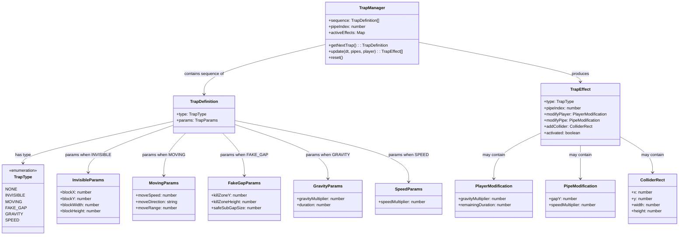

# Domain Entities: Cat Mario Trap System

## Entity Diagram



## Entity Definitions

### TrapManager
The singleton orchestrator that manages the deterministic trap sequence and processes active traps each frame.

| Field | Type | Description |
|---|---|---|
| sequence | TrapDefinition[] | Fixed array of 10 trap definitions |
| pipeIndex | number | Current position in sequence (0-9, wraps) |
| activeEffects | Map<number, ActiveTrapState> | Per-pipe active trap state tracking |

### TrapDefinition
Immutable data describing a trap assigned to a pipe position.

| Field | Type | Description |
|---|---|---|
| type | TrapType | The category of trap |
| params | object | Type-specific parameters |

### TrapType (Enum)
| Value | Description |
|---|---|
| NONE | No trap — safe pipe |
| INVISIBLE | Hidden collision block in/near gap |
| MOVING | Pipe gap shifts position over time |
| FAKE_GAP | Gap contains hidden kill zone with smaller safe passage |
| GRAVITY | Temporary gravity modification zone |
| SPEED | Pipe moves faster than normal |

### TrapEffect
Per-frame output describing how a trap modifies the game state.

| Field | Type | Nullable | Description |
|---|---|---|---|
| type | TrapType | No | Which trap produced this |
| pipeIndex | number | No | Which pipe this belongs to |
| modifyPlayer | PlayerModification | Yes | Player physics changes |
| modifyPipe | PipeModification | Yes | Pipe position/speed changes |
| addCollider | ColliderRect | Yes | Additional collision rectangle |
| activated | boolean | No | Whether trap has been triggered |

### PlayerModification
| Field | Type | Description |
|---|---|---|
| gravityMultiplier | number | Multiplier for CONFIG.GRAVITY (-1 to 3) |
| remainingDuration | number | Seconds remaining for effect |

### PipeModification
| Field | Type | Description |
|---|---|---|
| gapY | number | New gap center Y position (for MOVING) |
| speedMultiplier | number | Speed multiplier for this pipe (for SPEED) |

### ColliderRect
| Field | Type | Description |
|---|---|---|
| x | number | Left edge x-coordinate |
| y | number | Top edge y-coordinate |
| width | number | Width in pixels |
| height | number | Height in pixels |

### ActiveTrapState
Internal tracking for traps that have ongoing state (movement position, gravity timer).

| Field | Type | Description |
|---|---|---|
| elapsed | number | Time since trap activation |
| originalGapY | number | Original gap position (for MOVING) |
| activated | boolean | Whether player has encountered this trap |

## Pipe Entity Extension

The existing pipe object gains a `trap` field:

```javascript
// Extended pipe object
{
  x: number,           // existing
  gapY: number,        // existing
  gapSize: number,     // existing
  width: number,       // existing
  scored: boolean,     // existing
  trap: TrapDefinition | null,  // NEW — assigned trap or null
  trapState: ActiveTrapState | null  // NEW — runtime trap state
}
```

## Testable Properties (PBT-01 Compliance)

### Property Category: Invariant
| ID | Property | Category | Component |
|---|---|---|---|
| P1 | Trap sequence always returns same trap for same index | Invariant | TrapManager |
| P2 | pipeIndex wraps correctly: `getNextTrap()` called N times → pipeIndex === N % 10 | Invariant | TrapManager |
| P3 | Safe sub-gap in FAKE_GAP is always >= 50px | Invariant | TrapDefinition validation |
| P4 | Moving pipe gapY stays within canvas bounds | Invariant | MOVING trap logic |
| P5 | Speed multiplier is always within [1.5, 4.0] | Invariant | SPEED trap validation |
| P6 | Gravity multiplier is always within [-1.0, 3.0] | Invariant | GRAVITY trap validation |
| P7 | At least 2 NONE entries exist in any valid sequence | Invariant | Sequence validation |

### Property Category: Idempotence
| ID | Property | Category | Component |
|---|---|---|---|
| P8 | reset() followed by getNextTrap() always returns sequence[0] | Idempotence | TrapManager |
| P9 | Calling reset() multiple times is same as calling once | Idempotence | TrapManager |

### Property Category: Round-trip
| ID | Property | Category | Component |
|---|---|---|---|
| P10 | Serializing and deserializing a TrapDefinition produces identical object | Round-trip | TrapDefinition (if serialization added) |

### Property Category: Easy Verification
| ID | Property | Category | Component |
|---|---|---|---|
| P11 | For any INVISIBLE trap, there exists a player Y position that avoids the hidden block | Easy verification | INVISIBLE trap |
| P12 | For any FAKE_GAP trap, the safe sub-gap is physically passable (height > player height) | Easy verification | FAKE_GAP trap |
| P13 | For any MOVING trap at any elapsed time, the gap remains within canvas bounds | Easy verification | MOVING trap |

### Property Category: Oracle
| ID | Property | Category | Component |
|---|---|---|---|
| P14 | TrapManager.update() with no trapped pipes returns empty effects array | Oracle | TrapManager |
| P15 | Trap sequence index after N calls equals N % 10 (mathematical oracle) | Oracle | TrapManager |
