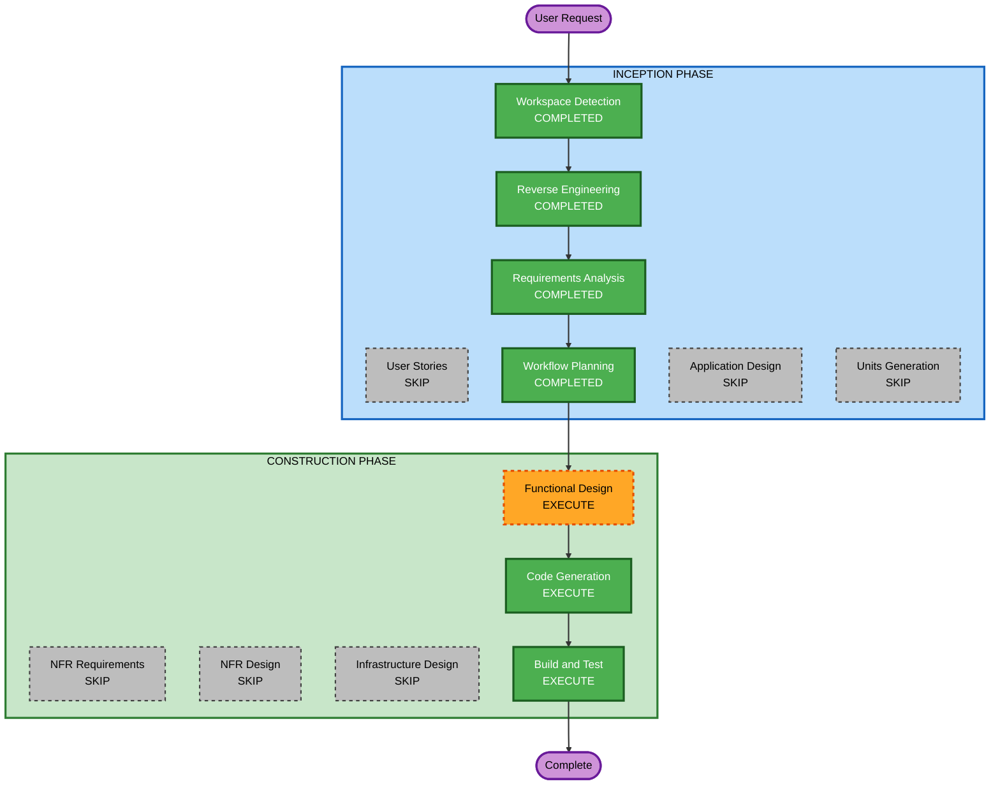

# Execution Plan

## Detailed Analysis Summary

### Transformation Scope
- **Transformation Type**: Single component addition + multi-component integration
- **Primary Changes**: New TrapManager module, modifications to PipeManager and GameEngine
- **Related Components**: PipeManager (trap attachment), GameEngine (trap orchestration), Player (gravity flip), CollisionDetector (fake gap detection)

### Change Impact Assessment
- **User-facing changes**: Yes — dramatically different gameplay experience with surprise mechanics
- **Structural changes**: Yes — new TrapManager component added to architecture
- **Data model changes**: Yes — pipe objects gain trap metadata, new trap sequence data structure
- **API changes**: Minor — PipeManager and GameEngine internal APIs extended
- **NFR impact**: Minimal — trap calculations are lightweight, deterministic

### Risk Assessment
- **Risk Level**: Medium — multiple components affected but changes are additive (not replacing existing logic)
- **Rollback Complexity**: Easy — trap system can be disabled by removing TrapManager integration
- **Testing Complexity**: Moderate — deterministic traps are highly testable, PBT well-suited

## Workflow Visualization



### Text Alternative
```
INCEPTION PHASE:
  1. Workspace Detection - COMPLETED
  2. Reverse Engineering - COMPLETED
  3. Requirements Analysis - COMPLETED
  4. User Stories - SKIP
  5. Workflow Planning - COMPLETED
  6. Application Design - SKIP
  7. Units Generation - SKIP

CONSTRUCTION PHASE:
  8. Functional Design - EXECUTE
  9. NFR Requirements - SKIP
  10. NFR Design - SKIP
  11. Infrastructure Design - SKIP
  12. Code Generation - EXECUTE
  13. Build and Test - EXECUTE
```

## Phases to Execute

### INCEPTION PHASE
- [x] Workspace Detection (COMPLETED)
- [x] Reverse Engineering (COMPLETED)
- [x] Requirements Analysis (COMPLETED)
- [x] User Stories - SKIP
  - **Rationale**: Single user type (player), simple interaction model, no acceptance criteria ambiguity
- [x] Workflow Planning (COMPLETED)
- [ ] Application Design - SKIP
  - **Rationale**: New TrapManager is straightforward; existing component boundaries are clear; no service layer design needed
- [ ] Units Generation - SKIP
  - **Rationale**: Single unit of work — all trap mechanics are one cohesive feature, no decomposition needed

### CONSTRUCTION PHASE
- [ ] Functional Design - EXECUTE
  - **Rationale**: Complex business logic with 5 trap types requiring detailed design. PBT-01 mandates property identification during design. Deterministic sequencing algorithm needs specification.
- [ ] NFR Requirements - SKIP
  - **Rationale**: Tech stack already determined (vanilla JS, vitest, fast-check). No new NFR concerns beyond what requirements document covers.
- [ ] NFR Design - SKIP
  - **Rationale**: No NFR patterns to incorporate. Performance is inherently handled by lightweight trap calculations.
- [ ] Infrastructure Design - SKIP
  - **Rationale**: No infrastructure — fully client-side browser game with static file serving.
- [ ] Code Generation - EXECUTE (ALWAYS)
  - **Rationale**: Implementation planning and code generation for TrapManager, trap types, and integration with existing components.
- [ ] Build and Test - EXECUTE (ALWAYS)
  - **Rationale**: Build verification, unit tests, and property-based tests for all trap mechanics.

### OPERATIONS PHASE
- [ ] Operations - PLACEHOLDER
  - **Rationale**: Future deployment and monitoring workflows

## Success Criteria
- **Primary Goal**: Flappy Usagi plays like Cat Mario — surprising, challenging, and deterministically unfair
- **Key Deliverables**:
  - TrapManager module with 4-5 trap types
  - Deterministic trap sequencing system
  - Integration with existing GameEngine/PipeManager
  - Comprehensive PBT test suite for trap logic
  - All existing tests continue to pass
- **Quality Gates**:
  - All trap types are survivable once learned
  - Deterministic behavior verified (same run = same traps)
  - PBT properties pass with no counterexamples
  - 60fps maintained with trap calculations active
