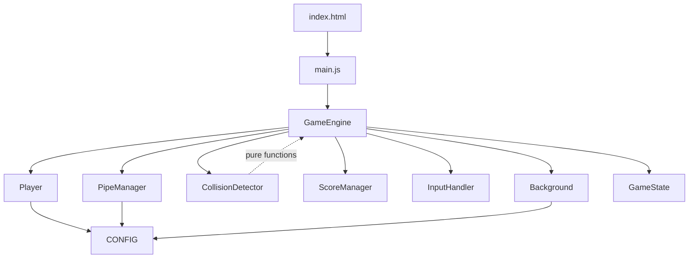
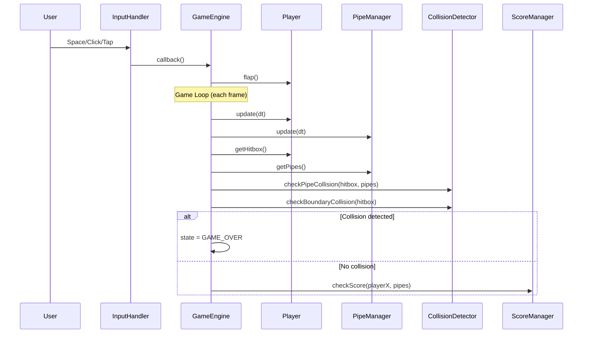

# System Architecture

## System Overview
Flappy Usagi is a single-page browser game built with vanilla JavaScript ES modules and HTML5 Canvas. It follows a component-based architecture where the GameEngine acts as the central orchestrator, coordinating Player, PipeManager, CollisionDetector, ScoreManager, InputHandler, and Background components through a requestAnimationFrame game loop.

## Architecture Diagram

## Component Descriptions

### GameEngine (game-engine.js)
- **Purpose**: Central orchestrator managing game lifecycle
- **Responsibilities**: Init, game loop (update/render), state transitions, component coordination
- **Dependencies**: Player, PipeManager, CollisionDetector, ScoreManager, InputHandler, Background, CONFIG, GameState
- **Type**: Application (core)

### Player (player.js)
- **Purpose**: Player character physics and rendering
- **Responsibilities**: Gravity, flap impulse, rotation, hitbox, sprite rendering
- **Dependencies**: CONFIG
- **Type**: Application (component)

### PipeManager (pipe-manager.js)
- **Purpose**: Obstacle generation and management
- **Responsibilities**: Spawn pipes at intervals, move pipes left, remove off-screen pipes
- **Dependencies**: CONFIG
- **Type**: Application (component)

### CollisionDetector (collision-detector.js)
- **Purpose**: Pure function collision detection
- **Responsibilities**: AABB overlap tests for pipes and boundaries
- **Dependencies**: None (pure functions)
- **Type**: Application (utility)

### ScoreManager (score-manager.js)
- **Purpose**: Score tracking and display
- **Responsibilities**: Increment score on pipe pass, track high score, render score
- **Dependencies**: None
- **Type**: Application (component)

### InputHandler (input-handler.js)
- **Purpose**: Input normalization across devices
- **Responsibilities**: Listen for keyboard/mouse/touch, dispatch callbacks
- **Dependencies**: None
- **Type**: Application (component)

### Background (background.js)
- **Purpose**: Visual environment rendering
- **Responsibilities**: Sky gradient, parallax clouds, scrolling ground
- **Dependencies**: CONFIG
- **Type**: Application (component)

### GameState (state.js)
- **Purpose**: State enumeration
- **Responsibilities**: Define READY, PLAYING, GAME_OVER states
- **Dependencies**: None
- **Type**: Application (model)

### CONFIG (config.js)
- **Purpose**: Centralized game configuration
- **Responsibilities**: All tunable game parameters (physics, dimensions, timing)
- **Dependencies**: None
- **Type**: Application (configuration)

## Data Flow

## Integration Points
- **External APIs**: None (fully client-side)
- **Databases**: None (session-only high score, no persistence)
- **Third-party Services**: None
- **Browser APIs**: Canvas 2D, requestAnimationFrame, DOM Events (keydown, mousedown, touchstart)
