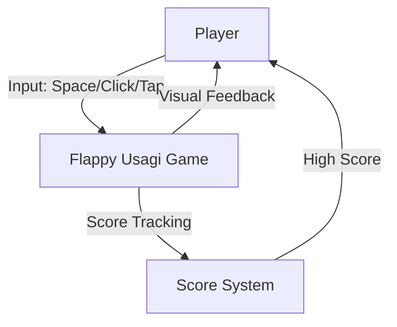

# Business Overview

## Business Context Diagram

## Business Description
- **Business Description**: Flappy Usagi is a browser-based arcade game inspired by Flappy Bird, featuring a rabbit (usagi) character that the player navigates through gaps between pipes by tapping/clicking to flap. The game provides casual entertainment with a simple one-button mechanic and score-based progression.
- **Business Transactions**:
  1. **Game Start** - Player initiates gameplay from the ready screen
  2. **Flap Action** - Player taps/clicks/presses space to make the character jump upward
  3. **Score Increment** - Score increases when the player passes through a pipe gap
  4. **Game Over** - Game ends when player collides with a pipe or boundary
  5. **Game Restart** - Player restarts from the game over screen
- **Business Dictionary**:
  - **Usagi**: Japanese for "rabbit" - the player character
  - **Flap**: The upward impulse applied when the player provides input
  - **Pipe**: Vertical obstacles with gaps that the player must navigate through
  - **Gap**: The opening between top and bottom pipe segments
  - **High Score**: The best score achieved in the current session

## Component Level Business Descriptions
### Game Engine
- **Purpose**: Orchestrates the entire game lifecycle including initialization, game loop, state transitions, and rendering
- **Responsibilities**: Frame timing, state management, component coordination, screen rendering

### Player
- **Purpose**: Represents the rabbit character controlled by the player
- **Responsibilities**: Physics simulation (gravity, flap), rotation animation, hitbox calculation, sprite rendering

### Pipe Manager
- **Purpose**: Manages the obstacle system that creates the game challenge
- **Responsibilities**: Pipe spawning at intervals, pipe movement, off-screen cleanup, gap positioning

### Collision Detector
- **Purpose**: Determines when the player has hit an obstacle or boundary
- **Responsibilities**: AABB collision detection against pipes and canvas boundaries

### Score Manager
- **Purpose**: Tracks player progress and achievements
- **Responsibilities**: Score counting when passing pipes, high score tracking, score display

### Input Handler
- **Purpose**: Normalizes player input across different devices
- **Responsibilities**: Keyboard, mouse, and touch event handling, callback dispatch

### Background
- **Purpose**: Provides visual environment and depth through parallax scrolling
- **Responsibilities**: Sky gradient, cloud parallax, ground scrolling
