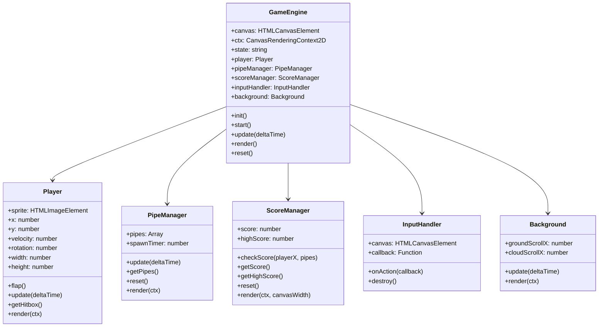

# Code Structure

## Build System
- **Type**: npm with ES modules
- **Configuration**: package.json (type: "module"), no bundler, direct browser ES module loading
- **Test Runner**: vitest (v3.1.4)
- **Property Testing**: fast-check (v4.1.1)

## Key Classes/Modules

### Existing Files Inventory
- `index.html` - Entry point HTML with canvas element and module script tag
- `src/main.js` - Application bootstrap (creates GameEngine, calls init/start)
- `src/game-engine.js` - Central game orchestrator (GameEngine class)
- `src/player.js` - Player character with physics (Player class)
- `src/pipe-manager.js` - Obstacle management (PipeManager class)
- `src/collision-detector.js` - Pure collision detection functions
- `src/score-manager.js` - Score tracking (ScoreManager class)
- `src/input-handler.js` - Input normalization (InputHandler class)
- `src/background.js` - Parallax background rendering (Background class)
- `src/config.js` - Game configuration constants (CONFIG object)
- `src/state.js` - Game state enumeration (GameState object)
- `vitest.config.js` - Vitest test runner configuration
- `usagi.webp` - Player character sprite image

### Test Files
- `src/background.test.js` - Background component tests
- `src/collision-detector.test.js` - Collision detection tests
- `src/config.test.js` - Configuration validation tests
- `src/game-engine.test.js` - Game engine tests
- `src/input-handler.test.js` - Input handler tests
- `src/pipe-manager.test.js` - Pipe manager tests
- `src/player.test.js` - Player physics tests
- `src/score-manager.test.js` - Score manager tests
- `src/state.test.js` - State enumeration tests

## Design Patterns

### Component Pattern
- **Location**: All src/*.js files
- **Purpose**: Separation of concerns - each game aspect is an independent component
- **Implementation**: Each component has update() and render() methods, managed by GameEngine

### Game Loop Pattern
- **Location**: GameEngine.start(), GameEngine.update(), GameEngine.render()
- **Purpose**: Consistent frame-rate-independent game updates
- **Implementation**: requestAnimationFrame with deltaTime calculation, capped at 100ms

### State Machine Pattern
- **Location**: GameEngine state transitions, GameState enum
- **Purpose**: Clear game state management (READY, PLAYING, GAME_OVER)
- **Implementation**: Simple string-based state with conditional logic in _handleInput() and update()

### Pure Function Pattern
- **Location**: collision-detector.js
- **Purpose**: Testable, side-effect-free collision logic
- **Implementation**: Exported pure functions taking data in, returning boolean

### Observer/Callback Pattern
- **Location**: InputHandler.onAction()
- **Purpose**: Decouple input detection from game logic
- **Implementation**: Single callback registration, invoked on any input event

## Critical Dependencies
### vitest
- **Version**: ^3.1.4
- **Usage**: Test runner for all unit tests
- **Purpose**: Fast, ESM-native testing

### fast-check
- **Version**: ^4.1.1
- **Usage**: Property-based testing library
- **Purpose**: Generative testing for game logic properties
