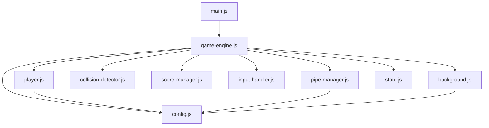

# Dependencies

## Internal Dependencies

### game-engine.js depends on all components
- **Type**: Runtime
- **Reason**: Orchestrates all game components

### player.js depends on config.js
- **Type**: Runtime
- **Reason**: Uses GRAVITY, FLAP_VELOCITY, MAX_ROTATION, MIN_ROTATION constants

### pipe-manager.js depends on config.js
- **Type**: Runtime
- **Reason**: Uses PIPE_SPEED, PIPE_SPAWN_INTERVAL, PIPE_WIDTH, GAP_SIZE, GAP_MIN_Y, GAP_MAX_Y_OFFSET

### background.js depends on config.js
- **Type**: Runtime
- **Reason**: Uses PIPE_SPEED for ground/cloud scroll speeds

### collision-detector.js has no dependencies
- **Type**: N/A
- **Reason**: Pure functions with no imports

### score-manager.js has no dependencies
- **Type**: N/A
- **Reason**: Self-contained score logic

### input-handler.js has no dependencies
- **Type**: N/A
- **Reason**: Uses only browser DOM APIs

## External Dependencies

### vitest
- **Version**: ^3.1.4
- **Purpose**: Test runner for unit and property-based tests
- **License**: MIT

### fast-check
- **Version**: ^4.1.1
- **Purpose**: Property-based testing (generative/fuzzing)
- **License**: MIT
